<h1 align="center">Unity Debug Sheet</h1>

[](LICENSE.md)

[日本語ドキュメント(Japanese Documents Available)](README_JA.md)

Hierarchical debug menu system for Unity that makes it easy to create intuitive and organized debug menus.

<p align="center">
  
</p>

## Table of Contents

<!-- START doctoc generated TOC please keep comment here to allow auto update -->
<!-- DON'T EDIT THIS SECTION, INSTEAD RE-RUN doctoc TO UPDATE -->
<details>
<summary>Details</summary>

- [Overview](#overview)
  - [Concept and Features](#concept-and-features)
  - [Demo](#demo)
- [Setup](#setup)
  - [Requirements](#requirements)
  - [Installation](#installation)
- [Quick Start](#quick-start)
  - [Place the prefab in the scene](#place-the-prefab-in-the-scene)
  - [Create the debug page](#create-the-debug-page)
  - [Add a link to the debug page.](#add-a-link-to-the-debug-page)
  - [Open and close the debug menu](#open-and-close-the-debug-menu)
  - [Result](#result)
- [Basic Usage](#basic-usage)
  - [List of Available Cells](#list-of-available-cells)
  - [Update the cell contents](#update-the-cell-contents)
  - [Workflow in multiple scenes](#workflow-in-multiple-scenes)
  - [Exclude from the release builds](#exclude-from-the-release-builds)
  - [Custom Cells](#custom-cells)
- [Advanced Usage](#advanced-usage)
  - [Use async methods instead of coroutines](#use-async-methods-instead-of-coroutines)
  - [Hide Backdrop](#hide-backdrop)
  - [Don't close the debug menu when the backdrop is clicked](#dont-close-the-debug-menu-when-the-backdrop-is-clicked)
  - [Change the Show/Hide animations](#change-the-showhide-animations)
  - [Work within the safe area](#work-within-the-safe-area)
  - [Change the min/max size of the debug menu](#change-the-minmax-size-of-the-debug-menu)
  - [Customize the look](#customize-the-look)
- [Extension Packages](#extension-packages)
  - [Display the system information of Unity](#display-the-system-information-of-unity)
  - [In-game Debug Console](#in-game-debug-console)
  - [Graphy](#graphy)
- [Licenses](#licenses)

</details>
<!-- END doctoc generated TOC please keep comment here to allow auto update -->

## Overview

### Concept and Features
In general, many debug commands are created during game development, and the number of them increases as development progresses.
As a result, it becomes difficult to find the desired command, which in turn leads to a decrease in development efficiency.

**Unity Debug Sheet** allows you to easily create a debug menu with a hierarchical structure.
Its GUI can be easily and intuitively controlled by anyone, especially on mobile platforms.

<p align="center">
  
</p>

Of course, it also supports vertical layout.

<p align="center">
  
</p>

Adding debug commands is also easy.

```cs
// Label
AddLabel("Example Label");

//　Button
AddButton("Example Button", clicked: () => { Debug.Log("Clicked"); });

// Switch
AddSwitch(false, "Example Switch", valueChanged: x => Debug.Log($"Changed: {x}"));

// Slider
AddSlider(0.5f, 0.0f, 1.0f, "Example Slider", valueChanged: x => Debug.Log($"Value Changed: {x}"));
```

### Demo
You can try the demo by cloning `this repository itself and playing the demo scenes.
The following demo scenes are av`ailable.

**Character Viewer: CharacterViewerDemo.unity**

This demo allows you to switch between character models, motions, etc. from the debug menu.
It also include samples that integrate with other libraries such as [Graphy](https://github.com/Tayx94/graphy) and [In-Game Debug Console](https://github.com/yasirkula/UnityIngameDebugConsole) to monitor performance.

<p align="center">
  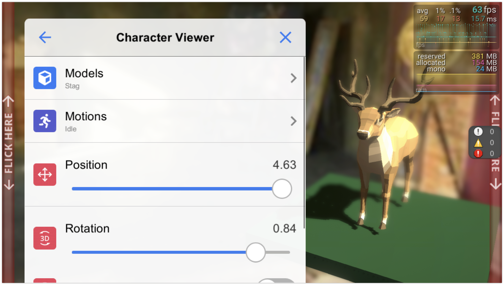
</p>

**Default Cells: DefaultCellsDemo.unity**

This demo allows you to check the behavior of all the cells (generic name for items such as button, labels, and sliders, etc.) that are included in this library by default.

<p align="center">
  
</p>

**Custom Cells: CustomCellsDemo.unity**

In addition to the default cells, you can create your own custom cells.
This demo shows how to create custom cells.

<p align="center">
  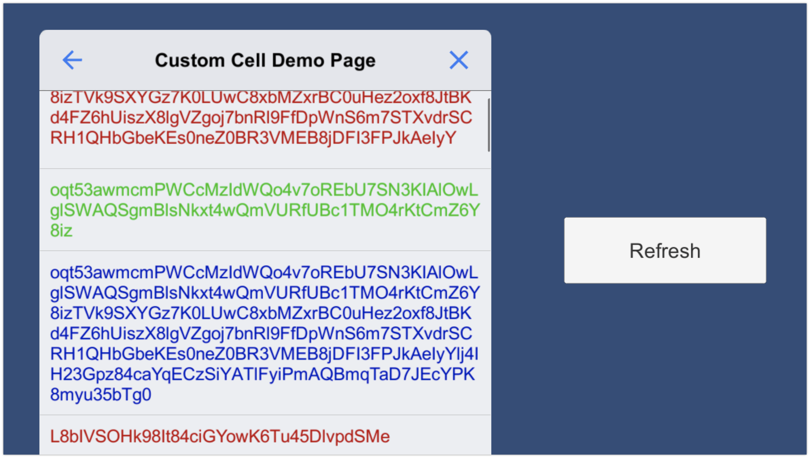
</p>

**Entry Scene: DemoEntry.unity**
The above three scenes can also be transitioned from the this scene.
You can see how the debug sheet placed in each scene behaves as singleton.

## Setup

### Requirements
This tool is compatible with the following environments.

- Unity 2020.3 or later

### Installation
You can install this library by the steps below.

1. Select **Window > Package Manager** from the menu bar.
2. Click the **+** button in the upper left corner of the window and select **Add package from git URL...**.
3. Enter the following URL in the input field and click **Add**.

```
https://github.com/Haruma-K/UnityDebugSheet?path=/Assets/UnityDebugSheet
```

<p align="center">
  
</p>

Or, you can also install by adding the following line to the `dependencies` block of `manifest.json` file in the `Packages` folder.

```json
{
  "dependencies": {
    "com.harumak.unitydebugsheet": "https://github.com/Haruma-K/UnityDebugSheet.git?path=/Assets/UnityDebugSheet"
  }
}
```

If you want to specify the version, you can do so by adding the version number to the end of the URL.

```
https://github.com/Haruma-K/UnityDebugSheet.git?path=/Assets/UnityDebugSheet#1.0.0
```

You can update the version by changing the version number above.  
If you do not specify the version, you can update it by opening the file `Packages/package-lock.json` and rewriting the hash of this library.

```json
{
  "dependencies": {
      "com.harumak.unitydebugsheet": {
      "version": "https://github.com/Haruma-K/UnityDebugSheet.git?path=/Assets/UnityDebugSheet",
      "depth": 0,
      "source": "git",
      "dependencies": {},
      "hash": "..."
    }
  }
}
```

## Quick Start
This section shows an easy way to set up and use the Unity Debug Sheet.

### Place the prefab in the scene
First, drag and drop the prefab named **DebugSheetCanvas** to **Hierarchy** window to place it in the scene.
And if **EventSystem** not exists, create it.

<p align="center">
  
</p>

### Create the debug page
Next, create a page for debugging.
Create the page by inheriting from `DefaultDebugPageBase` as shown below.  
The following is an example page with a single button that logs **Clicked** when clicked.

```cs
using System.Collections;
using UnityDebugSheet.Runtime.Core.Scripts;
using UnityEngine;

public sealed class ExampleDebugPage : DefaultDebugPageBase
{
    protected override string Title { get; } = "Example Debug Page";

    public override IEnumerator Initialize()
    {
        // Add a button to this page.
        AddButton("Example Button", clicked: () => { Debug.Log("Clicked"); });

        yield break;
    }
}
```

### Add a link to the debug page.
Next, add a link to transition to the debug page created above.  
Get the root page and add a link button to it as shown below.

```cs
using UnityDebugSheet.Runtime.Core.Scripts;
using UnityEngine;

public sealed class DebugSheetController : MonoBehaviour
{
    private void Start()
    {
        // Get or create the root page.
        var rootPage = DebugSheet.Instance.GetOrCreateInitialPage();

        // Add a link transition to the ExampleDebugPage.
        rootPage.AddPageLinkButton<ExampleDebugPage>(nameof(ExampleDebugPage));
    }
}
```

> **NOTE**
> If you want to use your own page as the root page instead of linking as above, use `Initialize<ExampleDebugPage>()` instead of `GetOrCreateInitialPage().AddPageLinkButton<ExampleDebugPage()`.

### Open and close the debug menu
The debug menu can be opened and closed by flicking up and down along the edge of the screen.
On the actual device, the area extends from the edge of the screen to approximately 6mm within the safe area.
In the demo scene, the red band is displayed in this area to visualize flickable range.

<p align="center">
  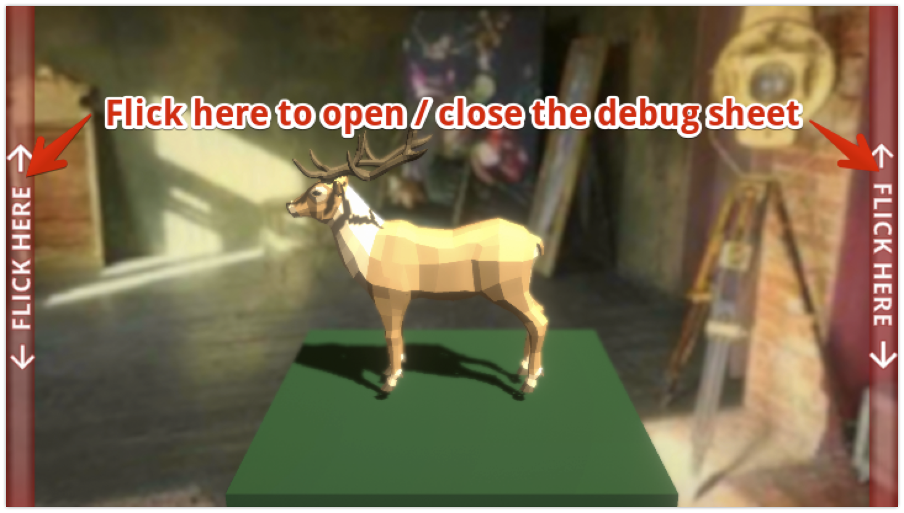
</p>

This behavior can be changed from the **Global Control Mode** on the **Debug Sheet** component.  
You can enable only the left or right side of the screen, or disable flick operation.

<p align="center">
  
</p>

> **Warning**
> In the Unity editor, this range is not necessarily 6mm because it simulate the resolution of the actual device.
> It is recommended to also use the operation with keyboard shortcuts described below.

You can use keyboard shortcuts to open and close the debug menu.
In default, **Control (Command on Mac) + Shift + D** toggles the debug menu.
Shortcuts can be freely changed from **Keyboard Shortcut** on the **Debug Sheet** component.

<p align="center">
  
</p>

And you can also open/close the debug menu from your script as below.

```cs
// These scripts are attached on the GameObject "DebugSheetCanvas > Drawer".
StatefulDrawer drawer;
StatefulDrawerController drawerController;

// Toggle debug sheet.
var isClosed = Mathf.Approximately(drawer.Progress, drawer.MinProgress);
var targetState = isClosed ? DrawerState.Max : DrawerState.Min;
drawerController.SetStateWithAnimation(targetState);
```

### Result
With the implementation up to this point, you can confirm that the debug menu works as follows.

<p align="center">
  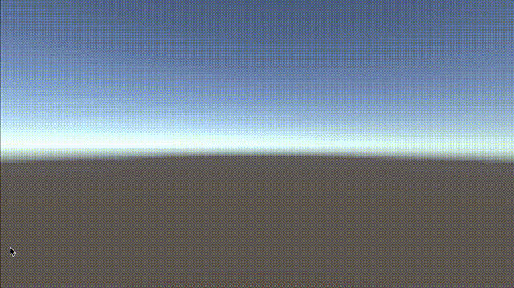
</p>

## Basic Usage
This section describes the basic usage of the Unity Debug Sheet.
The Quick Start section is the prerequisite, so please read it first.

### List of Available Cells
In default, you can use the following cells.

| Cell Name | Method Name to Add | Description |
| --- | --- | --- |
| Label | AddLabel | Used to display strings. |
| Button | AddButton | Used to trigger actions when clicked. |
| Switch | AddSwitch | Used to switch ON and OFF. |
| Slider | AddSlider | Used to specify a numerical value within a range. |
| Picker | AddPicker | Used to select one of several options. |
| Enum Picker | AddEnumPicker | Used to select one of the elements of the enum. |
| Multi Picker | AddMultiPicker | Used to select more than one from multiple options. |
| Enum Multi Picker | AddEnumMultiPicker | Used to select more than one from the elements of the enum. |
| Search Field | AddSearchField | Used to display the search field. |
| Page Link Button | AddPageLinkButton | Used to transition to the other debug pages when clicked. |
| Button Collection | AddButtonCollection | Use when you want to display many small buttons. |

You can check the behavior of each cell by playing the [Default Cells Demo Scene](Assets/Demo/02_DefaultCells/Scenes/DefaultCellsDemo.unity).
You can also create your own cells.
See the Custom Cells section for more information about this.

### Update the cell contents
Using **CellModel**, you can update the contents of the cell that has been generated.
The following is an example of renaming a generated button each time the **Space** key is pressed.
Please refer to the comments for details.

```cs
using System.Collections;
using UnityDebugSheet.Runtime.Core.Scripts;
using UnityDebugSheet.Runtime.Core.Scripts.DefaultImpl.Cells;
using UnityEngine;

public sealed class ExampleDebugPage : DefaultDebugPageBase
{
    private int _buttonCellIndex;
    private ButtonCellModel _buttonCellModel;
    private int _counter;
    protected override string Title => "Example Debug Page";

    public override IEnumerator Initialize()
    {
        // Create the CellModel and set data and events.
        var buttonCellModel = new ButtonCellModel(false);
        buttonCellModel.CellTexts.Text = GetButtonName();
        buttonCellModel.Clicked += () => { Debug.Log("Clicked"); };
        
        // Keep the index of the cell and the CellModel.
        _buttonCellIndex = AddButton(buttonCellModel);
        _buttonCellModel = buttonCellModel;
        
        yield break;
    }

    private void Update()
    {
        if (Input.GetKeyDown(KeyCode.Space))
        {
            // Update the cell data
            _counter++;
            _buttonCellModel.CellTexts.Text = GetButtonName();
            
            // Refresh the target cell.
            RefreshDataAt(_buttonCellIndex);
            
            // You can also refresh all data by calling RefreshData().
            //RefreshData();
        }
    }

    private string GetButtonName()
    {
        return $"Example Button {_counter}";
    }
}
```

### Workflow in multiple scenes
In default, **DebugSheetCanvas** is used as a singleton.
That is, if **DebugSheetCanvas** is placed in two scenes, the one instantiated first will be used and the one loaded later will be destroyed.

In this case, initialization should be only be done on the first `DebugSheet`.
If the order of scene loading is not guaranteed, you can use `DebugSheet.GetOrCreateInitializePage()` to get a page that has already been initialized, if any, and initialize it.
Please refer to the **DemoEntry** scene for the workflow in multiple scenes.

Note that if you do not want to use it as singleton, you can do it by unchecking **Singleton** in the **DebugSheet** component.

<p align="center">
  
</p>

### Exclude from the release builds
You should exclude **GameObject**, script files, and resources files related to the debug menu from the release builds.

You can exclude all scripts of the **Unity Debug Sheet** by adding **EXCLUDE_UNITY_DEBUG_SHEET** to the **Scripting Define Symbols** in the **Player Settings**.
Thus, if you enclose all your own code that accesses the **Unity Debug Sheet** with `#if EXCLUDE_UNITY_DEBUG_SHEET`, you can exclude all the code from the release builds.
It may also be a good idea to combine your own scripts that accesses the **Unity Debug Sheet** into a single assembly and set **Define Constraints** in the **asmdef**.

In addition, you can completely exclude the debug menu from your build by doing the following.

- Delete the **Resources** folder containing the debug menu resources if you have created.
- Delete the **GameObject** containing the **DebugSheet** component in your scenes.

### Custom Cells
To create your own cell, first create a component that inherits from **Cell** and a model that inherits from **CellModel** to set data to it.

```cs
using UnityDebugSheet.Runtime.Core.Scripts;
using UnityEngine;
using UnityEngine.UI;

public sealed class CustomTextCell : Cell<CustomTextCellModel>
{
    [SerializeField] private Text _text;
    [SerializeField] private LayoutElement _layoutElement;

    private const int Padding = 36;

    protected override void SetModel(CustomTextCellModel model)
    {
        _text.text = model.Text;
        _text.color = model.Color;
        _layoutElement.preferredHeight = _text.preferredHeight + Padding;
    }
}

public sealed class CustomTextCellModel : CellModel
{
    public string Text { get; set; }
    
    public Color Color { get; set; } = Color.black;
}
```

Then, create a GUI, attach this component to it, and make it a prefab.
Due to the implementation of the cell recycling system, the following points should be taken into account when implementing the cell.

- Attach a **Layout Element** to the root **GameObject** and input a height in the **Preferred Height** property.
- Set the width of the cell to a fixed value.

Next, set this cell to **Cell Prefabs** on the **Debug Sheet**.

<p align="center">
  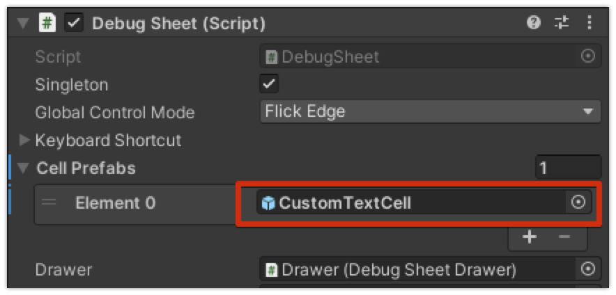
</p>

All that remains is to add this cell to the page.
Please refer to [the demo scene of the custom cells](Assets/Demo/03_CustomCells/Scenes/CustomCellsDemo.unity) for the actual implementation.

## Advanced Usage

### Use async methods instead of coroutines
You can also use asynchronous methods instead of coroutines to define lifecycle events of debug page, as shown below.

```cs
using UnityDebugSheet.Runtime.Core.Scripts;
using System.Threading.Tasks;

public class SomePage : DefaultDebugPageBase
{
    protected override string Title => "Some Page";

    // Using asynchronous methods to define lifecycle events
    public override async Task Initialize()
    {
        await Task.Delay(100);
    }
}
```

To use asynchronous methods, add `Scripting Define Symbols` in the following steps.

* Player Settings > Other Settings
* Add `UDS_USE_ASYNC_METHODS` to `Scripting Define Symbols`.

Note that `Scripting Define Symbols` needs to be set for all platforms.

### Hide Backdrop
In default, the black GUI is displayed as the backdrop of the debug menu.
You can hide it if you want by deactivating the **GameObject** of **DebugSheetCanvas > Backdrop**.

<p align="center">
  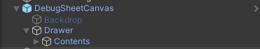
</p>

### Don't close the debug menu when the backdrop is clicked
In default, the debug menu is closed when the backdrop is clicked.
You can disable this behavior by unchecking **Close When Backdrop Clicked** in the **Stateful Drawer Backdrop Controller** component attached to the **DebugSheetCanvas > Drawer**.

<p align="center">
  
</p>

### Change the Show/Hide animations
You can change the Show/Hide animations by changing the **AnimationDuration** and **AnimationCurve** properties in the **Stateful Drawer** component attached to the **DebugSheetCanvas > Drawer**.

<p align="center">
  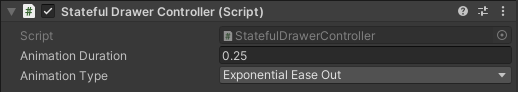
</p>

### Work within the safe area
By default, the debug menu appears from outside the screen, and is placed outside the screen when it is hidden.
You can work it within the safe area by checking **Move Inside Safe Area** property in the **Debug Sheet Drawer** component attached to the **DebugSheetCanvas > Drawer**.

<p align="center">
  
</p>

### Change the min/max size of the debug menu
You can also change the min/max size of the debug menu.
If you changed this, it can always be displayed at the bottom of the screen, even when minimized, as shown below, for example.

<p align="center">
  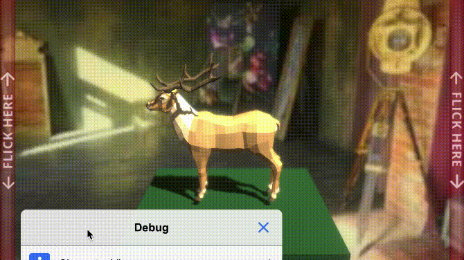
</p>

To change the size of each state, edit the properties of the **Debug Sheet Drawer** attached to **Debug Sheet Canvas > Drawer**.
Adjust the **Min's Progress** to change the size shen minimized and *Size* to change the size when maximized.
**Middle** is the middle size applied when held vertically.

<p align="center">
  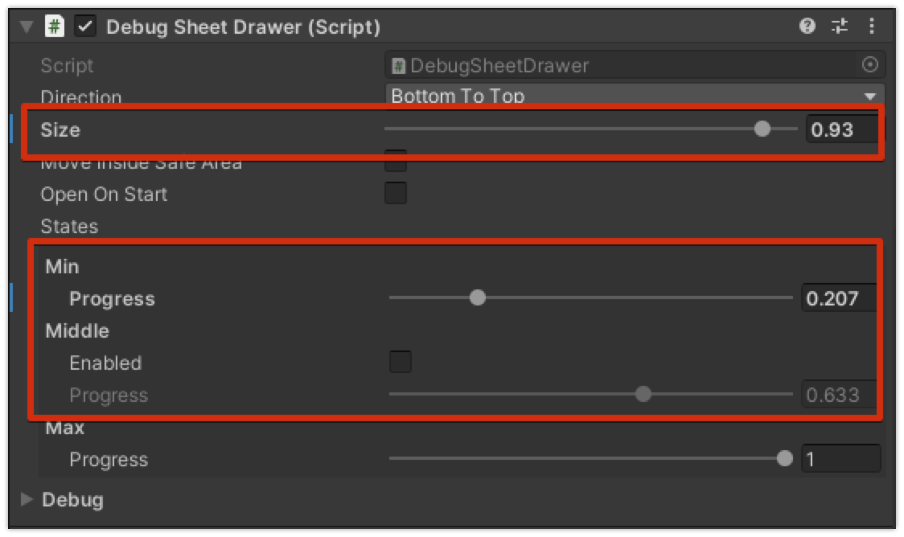
</p>

You can apply and check the size of each state by clicking **Set State** button in **Debug** area.

<p align="center">
  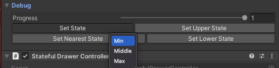
</p>

### Customize the look
Unity Debug Sheet consists of uGUI, so you can freely customize the look by adjusting the properties.

- Color of the back and close buttons
- Color of the backdrop
- Text color of the title

The design of each cell can be freely customized by creating a custom cell.
See the Custom Cells section for more information on this.

## Extension Packages

### Display the system information of Unity
Yuo can display the system information of Unity easily by this package.

<p align="center">
  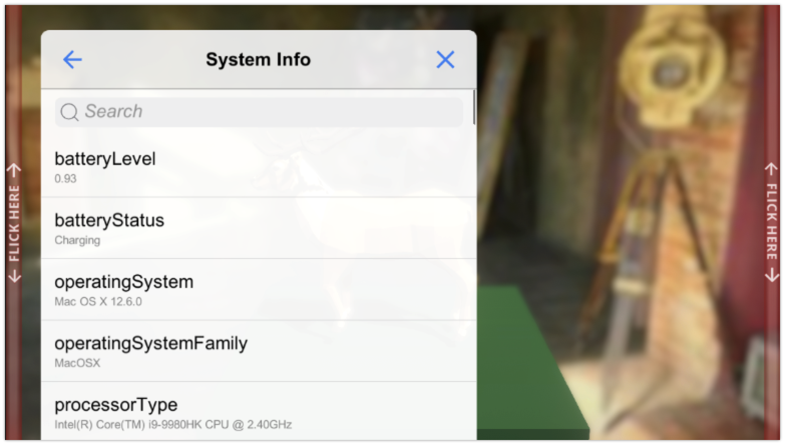
</p>

Following features are now available.

1. Information provided by Unity's SystemInfo class

Usage is as follows.

1. (Only if you use your own assembly) Add [UnityDebugSheet.Unity](Assets/UnityDebugSheet/Runtime/Extensions/Unity/UnityDebugSheet.Unity.asmdef) to the referenced assemblies.
2. Write as `DefaultDebugPageBase.AddPageLinkButton<SystemInfoDebugPage>("System Info")` to add page link cell.

### In-game Debug Console
This is an extension package that links the **Unity Debug Sheet** with [**In-game Debug Console**](https://github.com/yasirkula/UnityIngameDebugConsole) that is the OSS for displaying the console at runtime.  
By this package, you can easily add a debug menu to display the console.

<p align="center">
  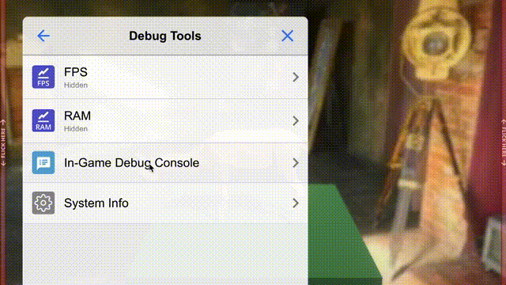
</p>

Usage is as follows.

1. Install [**In-game Debug Console**](https://github.com/yasirkula/UnityIngameDebugConsole). (There are several ways to install.)
2. (Only if you install 1. not via Package Manager) Add `UDS_INGAMEDEBUGCOSOLE_SUPPORT` to Scripting Define Symbols and restart Unity.
3. (Only if you use your own assembly) Add [UnityDebugSheet.IngameDebugConsole](Assets/UnityDebugSheet/Runtime/Extensions/IngameDebugConsole/UnityDebugSheet.IngameDebugConsole.asmdef) to the referenced assemblies.
4. Write as `DefaultDebugPageBase.AddPageLinkButton<IngameDebugConsoleDebugPage>("In-Game Debug Console", onLoad: x => x.Setup(DebugLogManager.Instance));` to add page link cell.

### Graphy
This is an extension package that links the **Unity Debug Sheet** with [**Graphy**](https://github.com/Tayx94/graphy) that is the OSS to display FPS, Memory, etc...  

<p align="center">
  
</p>

Usage is as follows.

1. Install [**Graphy**](https://github.com/Tayx94/graphy). (There are several ways to install.)
2. (Only if you install 1. not via Package Manager) Add `UDS_GRAPHY_SUPPORT` to Scripting Define Symbols and restart Unity.
3. (Only if you use your own assembly) Add [UnityDebugSheet.Graphy](Assets/UnityDebugSheet/Runtime/Extensions/Graphy/UnityDebugSheet.Graphy.asmdef) to the referenced assemblies.
4. Write as `DefaultDebugPageBase.AddPageLinkButton<GraphyDebugPage>("Graphy", onLoad: x => x.Setup(GraphyManager.Instance));` to add page link cell.

## Licenses
This software is released under the MIT License.
You are free to use it within the scope of the license, but the following copyright and license notices must be displayed when using it.

- [LICENSE.md](LICENSE.md)

In addition, the table of contents of this document was created using the following software

- [toc-generator](https://github.com/technote-space/toc-generator)

The following software is used in the demo scenes.

- [https://github.com/yasirkula/UnityIngameDebugConsole](https://github.com/yasirkula/UnityIngameDebugConsole)
- [https://github.com/Tayx94/graphy](https://github.com/Tayx94/graphy)

See Third Party Notices.md for details on these licenses.
