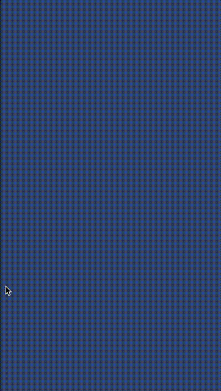
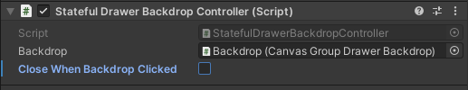

<h1 align="center">Unity Debug Sheet</h1>

[](LICENSE.md)

[English Documents Available(英語ドキュメント)](README.md)

直感的で整理されたデバッグメニューを簡単に作成できる、Unityのための階層型デバッグメニューシステムです。

<p align="center">
  
</p>

## 目次

<!-- START doctoc generated TOC please keep comment here to allow auto update -->
<!-- DON'T EDIT THIS SECTION, INSTEAD RE-RUN doctoc TO UPDATE -->
<!-- param::title::詳細:: -->

<!-- END doctoc generated TOC please keep comment here to allow auto update -->

## 概要

### コンセプトと特徴
一般的に、ゲーム開発中には多くのデバッグコマンドが作られ、またその数は開発が進むにつれて増えていきます。  
そのため次第に目的のコマンドが見つけづらくなり、結果として開発効率の低下を招きます。

**Unity Debug Sheet** を使うと、階層構造を持つデバッグメニューを簡単に作ることができます。  
誰でも迷わず直感的に扱えるGUIを目指しており、特にモバイルプラットフォームでも操作性が悪化しないことを意識しています。

<p align="center">
  
</p>

もちろん縦方向のレイアウトにも対応しています。

<p align="center">
  
</p>

デバッグコマンドの追加も以下のように簡単です。

```cs
// Label
AddLabel("Example Label");

//　Button
AddButton("Example Button", clicked: () => { Debug.Log("Clicked"); });

// Switch
AddSwitch(false, "Example Switch", valueChanged: x => Debug.Log($"Changed: {x}"));

// Slider
AddSlider(0.5f, 0.0f, 1.0f, "Example Slider", valueChanged: x => Debug.Log($"Value Changed: {x}"));
```

### デモ
デモシーンはこのリポジトリ自体をクローンし、当該シーンを再生することで利用できます。  
以下のデモシーンを用意しています。

**キャラクタービューワー: CharacterViewerDemo.unity**

キャラクターモデルやモーションなどをデバッグメニューから切り替えるデモです。  
また、[Graphy](https://github.com/Tayx94/graphy) や [In-Game Debug Console](https://github.com/yasirkula/UnityIngameDebugConsole) といった他ライブラリとインテグレーションを行い、パフォーマンスをモニタリングできるサンプルを実装しています。

<p align="center">
  
</p>

**デフォルトセル: DefaultCellsDemo.unity**

本ライブラリにデフォルトで組み込まれているセル（ボタンやラベル、スライダーといった各項目の総称）の挙動を一通り確認することができます。

<p align="center">
  
</p>

**カスタムセル: CustomCellsDemo.unity**

デフォルトセルの他、ユーザは自由にカスタムしたセルを使うこともできます。  
これはカスタムセルの使い方を示したデモです。

<p align="center">
  
</p>

**エントリーシーン: DemoEntry.unity**

上記三つのシーンは以下のシーンから遷移することも可能です。  
各シーンに置かれているデバッグメニューがシングルトンとして振る舞う様子を確認できます。

## セットアップ

### 要件
本ツールは以下の環境に対応しています。

- Unity 2020.3 以上

### インストール
インストールは以下の手順で行います。

1. **Window > Package Manager** を選択
2. **「+」ボタン > Add package from git URL** を選択
3. 以下を入力してインストール
    - [https://github.com/Haruma-K/UnityDebugSheet.git?path=/Assets/UnityDebugSheet](https://github.com/Haruma-K/UnityDebugSheet.git?path=/Assets/UnityDebugSheet)

<p align="center">
  
</p>

あるいは **Packages/manifest.json** を開き、**dependencies** ブロックに以下を追記します。

```json
{
   "dependencies": {
      "com.harumak.unitydebugsheet": "https://github.com/Haruma-K/UnityDebugSheet.git?path=/Assets/UnityDebugSheet"
   }
}
```

バージョンを指定したい場合には以下のように記述します（末尾のバージョンは適宜書き換えてください）。

- [https://github.com/Haruma-K/UnityDebugSheet.git?path=/Assets/UnityDebugSheet#1.0.0](https://github.com/Haruma-K/UnityDebugSheet.git?path=/Assets/UnityDebugSheet#1.0.0)

バージョンを更新するには上述の手順でバージョンを書き換えてください。  
バージョンを指定しない場合には、**Packages/package-lock.json** ファイルを開いて本ライブラリの箇所のハッシュを書き換えることで更新できます。

```json
{
   "dependencies": {
      "com.harumak.unitydebugsheet": {
         "version": "https://github.com/Haruma-K/UnityDebugSheet.git?path=/Assets/UnityDebugSheet",
         "depth": 0,
         "source": "git",
         "dependencies": {},
         "hash": "..."
      }
   }
}
```

## クイックスタート
ここでは Unity Debug Sheet を簡単にセットアップして使う方法をまとめます。

### Prefabをシーンに配置する
まず **DebugSheetCanvas** という名前の Prefab を Hierarchy にドラッグ&ドロップして配置します。  
また、**EventSystem** が存在していなかったら作成しておきます。

<p align="center">
  
</p>

### デバッグページを作成する
次にデバッグ用のページを作成します。  
ページは以下のように `DebugPageBase` を継承することで作成します。  
以下では、押下したときに **Clicked** とログ出力されるボタンを一つだけ持つページを作成しています。

```cs
using System.Collections;
using UnityDebugSheet.Runtime.Core.Scripts;
using UnityEngine;

public sealed class ExampleDebugPage : DebugPageBase
{
    protected override string Title { get; } = "Example Debug Page";

    public override IEnumerator Initialize()
    {
        // Add a button to this page.
        AddButton("Example Button", clicked: () => { Debug.Log("Clicked"); });

        // Shen you added any item, call Reload(). 
        Reload();

        yield break;
    }
}
```

### デバッグメニューを初期化する
次に、デバッグメニューを初期化するスクリプトを作成します。  
以下のように、前節で作った **ExampleDebugPage** を使って **DebugSheet** を初期化します。

```cs
using UnityDebugSheet.Runtime.Core.Scripts;
using UnityEngine;

public sealed class DebugSheetController : MonoBehaviour
{
    private void Start()
    {
        DebugSheet.Instance.Initialize<ExampleDebugPage>();
    }
}
```

### デバッグメニューの開き方と閉じ方
デバッグメニューは画面の端の方を上下にフリックすることで開いたり閉じたりすることができます。  
実機では、画面端からセーフエリア内およそ6mmまでがこの範囲となります。  
デモシーンでは、このエリアに赤い帯を表示してフリック可能な範囲を可視化しています。

<p align="center">
  
</p>

また、この挙動は **Debug Sheet** の **Global Control Mode** から変更することができます。  
画面の左右どちらかだけを有効にしたり、フリックによる操作を無効にしたりできます。

<p align="center">
  
</p>

> **Warning**
> Unityエディタでは、実機の解像度が擬似的にシミュレーションされるため、必ずしもこの範囲が6mmにはなりません。後述のキーボードショットカットによる操作も併用することをお勧めします。

キーボードを使って開閉することもできます。  
デフォルトでは、**Control (Mac の場合はCommand) + Shift + D** でデバッグメニューをトグルします。  
ショートカットは Debug Sheet の **Keyboard Shortcut** から自由に変更することができます。

<p align="center">
  
</p>

また、以下のようにすればスクリプトで開閉することもできます。

```cs
// These scripts are attached on the GameObject "DebugSheetCanvas > Drawer".
StatefulDrawer drawer;
StatefulDrawerController drawerController;

// Toggle debug sheet.
var isClosed = Mathf.Approximately(drawer.Progress, drawer.MinProgress);
var targetState = isClosed ? DrawerState.Max : DrawerState.Min;
drawerController.SetStateWithAnimation(targetState);
```

### ここまでの結果
ここまでの実装で、再生をすると以下のようなデバッグメニューが動作することを確認できます。

<p align="center">
  
</p>

## 基本的な使い方
次に Unity Debug Sheet を使う上での基礎知識を解説します。  
クイックスタートの内容が前提知識となりますので、そちらを先にお読みください。

### 使用できるセル一覧
デフォルトで使用できるセル一覧は以下の通りです。

| セル名 | 追加するためのメソッド名 | 用途 |
| --- | --- | --- |
| Label | AddLabel | 文字列を表示するために使用します。 |
| Button | AddButton | 押下した時にアクションを起こすために使用します。 |
| Switch | AddSwitch | ON・OFFを切り替えるために使用します。 |
| Slider | AddSlider | 指定した範囲で数値を指定するために使用します。 |
| Picker | AddPicker | 複数の選択肢から一つを選択するために使用します。 |
| Enum Picker | AddEnumPicker | Enumの要素から一つを選択するために使用します。 |
| Multi Picker | AddMultiPicker | 複数の選択肢から複数を選択するために使用します。 |
| Enum Multi Picker | AddEnumMultiPicker | Enumの要素から複数を選択するために使用します。 |
| Page Link Button | AddPageLinkButton | 押下した時に他のデバッグページへの遷移を行うために使用します。 |

なお[デフォルトセルのデモシーン](Assets/Demo/02_DefaultCells/Scenes/DefaultCellsDemo.unity)を再生すると、これらのセルの挙動を確認することができます。

また独自のセルを作成することもできます。これについての詳細はカスタムセルの項目を参照してください。

### セルの内容を更新する
**CellModel** を使うことで、一度生成したセルの内容を更新することができます。  
以下は生成したボタンの名前を **Space** キーが押されるたびに変更する例です。  
詳細はコメントに記述してあるので参照してください。

```cs
using System.Collections;
using UnityDebugSheet.Runtime.Core.Scripts;
using UnityDebugSheet.Runtime.Core.Scripts.DefaultImpl.Cells;
using UnityEngine;

public sealed class ExampleDebugPage : DebugPageBase
{
    private int _buttonCellIndex;
    private ButtonCellModel _buttonCellModel;
    private int _counter;
    protected override string Title => "Example Debug Page";

    public override IEnumerator Initialize()
    {
        // Create the CellModel and set data and events.
        var buttonCellModel = new ButtonCellModel(false);
        buttonCellModel.CellTexts.Text = GetButtonName();
        buttonCellModel.Clicked += () => { Debug.Log("Clicked"); };
        
        // Keep the index of the cell and the CellModel.
        _buttonCellIndex = AddButton(buttonCellModel);
        _buttonCellModel = buttonCellModel;

        Reload();
        
        yield break;
    }

    private void Update()
    {
        if (Input.GetKeyDown(KeyCode.Space))
        {
            // Update the cell data
            _counter++;
            _buttonCellModel.CellTexts.Text = GetButtonName();
            
            // Refresh the target cell.
            RefreshDataAt(_buttonCellIndex);
            
            // You can also refresh all data by calling RefreshData().
            //RefreshData();
        }
    }

    private string GetButtonName()
    {
        return $"Example Button {_counter}";
    }
}
```

### 複数シーンにおけるワークフロー
デフォルトでは、**DebugSheetCanvas** はシングルトンとして扱われます。  
つまり二つのシーンに **DebugSheetCanvas** が配置されていた場合、先にインスタンス化されたものが使用され、後からロードされたものは破棄されます。

初期化は最初にインスタンスされた `DebugSheet` にのみ行う必要があります。  
シーンの読み込み順が不定の場合、`DebugSheet.GetOrCreateInitialPage()` を使うことで、既に初期化されているページがあればそれを取得し、なければ初期化することができます。  
複数シーンにおけるワークフローは **DemoEntry** シーンを参考にしてください。

なお、**DebugSheet** コンポーネントの **Singleton** のチェックを外すとシングルトンとしては扱わず、複数のデバッグシートをインスタンス化することができます。

<p align="center">
  
</p>

### リリースビルドから除外する
リリースビルドでは、デバッグメニューの **GameObject** やスクリプトファイル、リソースファイルを除外する必要があります。

**Scripting Define Symbols** に **EXCLUDE_UNITY_DEBUG_SHEET** を 加えると **Unity Debug Sheet** に関連する全てのコードがコンパイル対象から除外されます。  
したがって、**Unity Debug Sheet** にアクセスするコードをすべて`#if !EXCLUDE_UNITY_DEBUG_SHEET` と `#endif`で囲っておけば、リリース時に関連するスクリプトを全て除外できます。  
**Unity Debug Sheet** にアクセスするコードを一つのアセンブリにまとめて、**asmdef** の **Define Constraints** を設定するのもいいかもしれません。

加えて以下の対応を行うと、ビルドから完全にデバッグメニューを除外できます。

- デバッグメニュー用のリソースを入れた **Resources** フォルダを作成していたらそれを削除する
- シーン上の **Unity Debug Sheet** の **GameObject** を削除する

### カスタムセル

独自のセルを作るためには、まず `Cell` を継承したコンポーネントとそれにデータをセットするための `CellModel` を継承したモデルを作成します。

```cs
using UnityDebugSheet.Runtime.Core.Scripts;
using UnityEngine;
using UnityEngine.UI;

public sealed class CustomTextCell : Cell<CustomTextCellModel>
{
    [SerializeField] private Text _text;
    [SerializeField] private LayoutElement _layoutElement;

    private const int Padding = 36;

    protected override void SetModel(CustomTextCellModel model)
    {
        _text.text = model.Text;
        _text.color = model.Color;
        _layoutElement.preferredHeight = _text.preferredHeight + Padding;
    }
}

public sealed class CustomTextCellModel : CellModel
{
    public string Text { get; set; }
    
    public Color Color { get; set; } = Color.black;
}
```

あとは GUI を作成し、このコンポーネントをアタッチして Prefab 化します。  
セルのリサイクルシステムの実装の関係上、以下の点に注意してセルを実装してください。

- ルート **GameObject** に **Layout Element** をアタッチし、**Preferred Height** に高さを入力すること
- セルの横幅は固定値に設定すること

次にこのセルを **Debug Sheet** の **Cell Prefabs** に設定します。

<p align="center">
  
</p>

あとは通常通りこのセルをページに追加するだけです。  
実際の実装は[カスタムセルのデモシーン](Assets/Demo/03_CustomCells/Scenes/CustomCellsDemo.unity)を参考にしてください。

## 応用的な使い方

### 背景を非表示にする
デフォルトではデバッグメニューの背景として、半透明の黒い **GUI** が表示されます。  
これを非表示にするには、**DebugSheetCanvas > Backdrop** の **GameObject** を非アクティブにします。

<p align="center">
  
</p>

### 背景をクリックしても閉じない様にする
デフォルトでは、デバッグメニューの背景をクリックするとデバッグメニューが閉じる挙動になっています。  
背景を表示しつつも、クリックしても閉じないようにするには、**DebugSheetCanvas > Drawer** にアタッチされている **Stateful Drawer Backdrop Controller** の **Close When Backdrop Clicked** のチェックを外します。

<p align="center">
  
</p>

### 表示・非表示アニメーションを変更する
Drawerが表示または非表示になる時のアニメーションを変更するには **DebugSheetCanvas > Drawer** にアタッチされている **Stateful Drawer Controller** の **Animation Duration** や **Animation Type** を変更します。

<p align="center">
  
</p>

### セーフエリア内で動作させる
デフォルトでは、デバッグメニューは画面の外側から出現し、非表示状態になると画面の外側に格納されます。  
**Debug Sheet Canvas > Drawer** にアタッチされている **Debug Sheet Drawer** の **Move Inside Safe Area** にチェックを入れると、セーフエリアの外側から出現し、セーフエリアの外側に格納される挙動に変更することができます。

<p align="center">
  
</p>

### 最小・最大サイズの調整
デバッグメニューが最小化されているときや最大化されているときのサイズを調整することもできます。  
これを調整すると、例えば、以下のように、最小化されている状態でも常に画面下に表示しておくことができます。

<p align="center">
  
</p>

各状態のサイズを変更するには、**Debug Sheet Canvas > Drawer** にアタッチされている **Debug Sheet Drawer** のプロパティを編集します。  
最小化されている時の大きさを変えるには **Min** の **Progress** を、最大化されている時の大きさを変えるには **Size** を調整します。  
**Middle** は縦持ちにした時に適用される、中間のサイズです。

<p align="center">
  
</p>

**Debug** の **Set State** ボタンを押下すると、各状態におけるサイズを適用してデバッグ用に確認することができます。

<p align="center">
  
</p>

### デザインをカスタムする
Unity Debug Sheet は uGUI で構成されているので、プロパティを調整することであらゆる箇所の色を自由に変更することができます。

- 戻るボタンや閉じるボタンの色
- シートの背景色
- タイトルの文字色

各セルのデザインはカスタムセルを作成することで自由に作成できます。  
これについての詳細はカスタムセルの項目を参照してください。

## ライセンス
本ソフトウェアはMITライセンスで公開しています。ライセンスの範囲内で自由に使っていただけますが、使用の際は以下の著作権表示とライセンス表示が必須となります。

- [LICENSE.md](LICENSE.md)

また、本ドキュメントの目次は以下のソフトウェアを使用して作成されています。

- [toc-generator](https://github.com/technote-space/toc-generator)

デモシーンでは以下のソフトウェアを使用しています。

- [https://github.com/yasirkula/UnityIngameDebugConsole](https://github.com/yasirkula/UnityIngameDebugConsole)
- [https://github.com/Tayx94/graphy](https://github.com/Tayx94/graphy)

これらのライセンスの詳細は Third Party Notices.md を参照してください。
